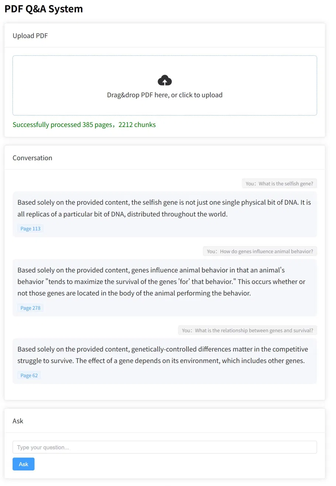

# PDF Q&A System

An AI-powered PDF question-answering system built with RAG (Retrieval-Augmented Generation).
Upload any PDF and ask questions in natural language — the AI answers based on the document content and cites the source page.



## Features

- Upload PDF files via drag-and-drop
- Ask questions in natural language
- AI answers based strictly on document content
- Source page citations for every answer
- Conversation history display

## Tech Stack

**Backend**
- Python / FastAPI
- LangChain (document loading, text splitting, vector search)
- ChromaDB (local vector database)
- HuggingFace Embeddings (paraphrase-multilingual-MiniLM-L12-v2)
- DeepSeek API (LLM)

**Frontend**
- Next.js
- React
- TypeScript
- Tailwind CSS

## How It Works
PDF Upload
→ Extract text (PyPDF)
→ Split into chunks (500 tokens, 50 overlap)
→ Generate embeddings (HuggingFace)
→ Store in ChromaDB
User Question
→ Generate question embedding
→ Retrieve top 3 similar chunks
→ Send chunks + question to DeepSeek
→ Return answer with source pages

## Getting Started

### Prerequisites
- Python 3.11+
- Node.js 18+
- DeepSeek API Key

### Backend Setup

```bash
cd backend
python -m venv venv
venv\Scripts\activate        # Windows
pip install -r requirements.txt
```

Set your API key:
```bash
export DEEPSEEK_API_KEY=your_key_here   # Mac/Linux
$env:DEEPSEEK_API_KEY="your_key_here"  # Windows
```

Start the server:
```bash
uvicorn app:app --reload
```

### Frontend Setup

```bash
cd frontend
npm install
npm run dev
```

Open `http://localhost:3000`

## Usage

1. Upload a PDF file by dragging it to the upload area
2. Wait for processing (large files may take a moment)
3. Type your question in the input field
4. Click "提问" to get an AI-generated answer
5. View the source page citations below each answer

## Project Structure

```
pdf-qa-system/
├── backend/
│   ├── app.py              # FastAPI backend
│   ├── rag.py              # RAG pipeline (development/testing)
│   └── requirements.txt    # Python dependencies
├── frontend/
│   ├── src/
│   │   ├── App.vue         # Main application component
│   │   └── main.js         # Vue app entry point
│   └── package.json
├── demo.png
└── README.md
```

## License

MIT
